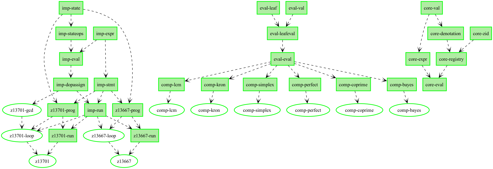

# Wikifunctions × Lean

Formal specifications for — and machine-checked verification of — functions from the
[Wikifunctions](https://www.wikifunctions.org) project (the executable-function library of
WikiLambda / Abstract Wikipedia), against [Mathlib](https://github.com/leanprover-community/mathlib4)
as ground truth.

Grew out of (and consumes mappings from) [WikiLean](https://github.com/Deicyde/WikiLean):
a Wikidata item links to its Wikifunctions function via a `wikifunctionswiki` sitelink
(e.g. [Q104752 "coprime integers"](https://www.wikidata.org/wiki/Q104752) ↔
[Z13701 "are coprime"](https://www.wikifunctions.org/wiki/Z13701)), and WikiLean maps the
same QID to a Mathlib declaration — so **the Wikidata QID joins an executable Wikifunction
to a machine-checked formal definition**. That formal definition is exactly the
specification Wikifunctions lacks (it has example-based testers, but no proofs or contracts).

**Interactive blueprint:** <https://deicyde.github.io/wikifunctions/> &nbsp;·&nbsp;
**WikiLean report:** <https://wikilean.jackmccarthy.org/wikifunctions>

## Reading materials

Start at the top and work down — from the visual map to the raw sources.

### This project

1. **[Interactive blueprint](https://deicyde.github.io/wikifunctions/)** — the dependency
   graph of the whole formalization ([graph view](https://deicyde.github.io/wikifunctions/dep_graph_document.html)).
   Every node links to its exact Lean source line **and** the live WikiLambda object it
   models; green = statement + proof complete; edges are `\uses` dependencies.
2. **[BLUEPRINT.md](BLUEPRINT.md)** — the human-checkable citation map: each Lean
   declaration side-by-side with the exact WikiLambda artifact it models (deep-linked spec
   sections, schemata files, live API fetches), each ending in a one-command reproduction
   `Check:`.
3. **[SPEC_AUDIT.md](SPEC_AUDIT.md)** — conformance audit against the four-layer spec stack
   below: 18 confirmed divergences (D1–D18), 66 verified matches, a per-component verdict
   table, and a prioritized fix list.
4. **[WIKIFUNCTIONS_SPECS.md](WIKIFUNCTIONS_SPECS.md)** — per-function report over the
   25-member addressable set: signatures, oracles, faithfulness notes, tiers.
5. **[blueprint/README.md](blueprint/README.md)** — how to build, serve, and re-verify the
   blueprint locally; `blueprint/check_decls.py` confirms every blueprint node names a real
   Lean declaration (47/47).



### The Wikifunctions specification (the four-layer stack we audit against)

There is no single normative document; "the specification" is a stack, cited throughout the
audit and blueprint (see [SPEC_AUDIT.md §1](SPEC_AUDIT.md)):

1. **Prose function model** — [Wikifunctions:Function_model](https://www.wikifunctions.org/wiki/Wikifunctions:Function_model)
   (the canonical home; the old mediawiki.org page no longer exists), plus the
   [error representation](https://meta.wikimedia.org/wiki/Abstract_Wikipedia/Representation_of_errors).
2. **Machine schemata** — [function-schemata](https://gitlab.wikimedia.org/repos/abstract-wiki/wikifunctions/function-schemata)
   (`data/CANONICAL/*.yaml`): the JSON-Schema the platform enforces.
3. **Live objects** — the deployed ZObjects via the API, e.g.
   `curl "https://www.wikifunctions.org/w/api.php?action=wikilambda_fetch&format=json&zids=Z13701"`.
4. **Deployed runtime** — [function-orchestrator](https://gitlab.wikimedia.org/repos/abstract-wiki/wikifunctions/function-orchestrator)
   / [function-evaluator](https://gitlab.wikimedia.org/repos/abstract-wiki/wikifunctions/function-evaluator):
   evaluation order, implementation selection, and the RustPython/wasm sandbox.

## Tiers

| tier | meaning |
|---|---|
| `composite_provable` | computable/decidable ℕ/ℤ oracle — conformance is provable in-kernel (`decide`) |
| `oracle_testable` | computable oracle as differential-test ground truth: ℚ/ℤ exact arithmetic, **and** `Float` oracles for `float64` functions (Lean `Float` is IEEE-754 binary64, `#eval`-comparable bit-for-bit to the live function) |
| `spec_only` | noncomputable real oracle only (e.g. arbitrary-precision Gamma) |

`float64` Wikifunctions are modelled with Lean's `Float` (operational, `Z*_spec`) plus a
`noncomputable Real` ideal (`Z*_ideal`) documenting the exact function approximated.

## Layout

The repo root **is** the lake project (pinned mathlib via git-require; first build:
`lake exe cache get` fetches prebuilt oleans):

```
├── lakefile.toml / lean-toolchain      ← pinned mathlib @ Lean v4.32.0-rc1
├── Wikifunctions/
│   ├── Core.lean                       ← open, registry-parameterized composite-evaluator core
│   └── Python/
│       ├── Imp.lean                    ← imperative-Python deep embedding + fuel semantics
│       ├── Z13701Prog.lean             ← deployed "are coprime" program as data (Mathlib-free)
│       ├── Z13701.lean                 ← proof: runProgram a b = some (decide (Nat.Coprime a b))
│       ├── Z13667Prog.lean             ← deployed "factorial" program as data (Mathlib-free)
│       └── Z13667.lean                 ← proof: runFac n = some (Nat.factorial n)
├── DiffDriver.lean                     ← `lake build diffdriver`: embedding side of the difftest
├── WikifunctionsSpecs.lean             ← the spec corpus (standalone; check via `lake env lean`)
├── WikifunctionsEval.lean              ← verified composite-evaluator PoC (standalone; 6 real Z14K2 bodies)
├── blueprint/                          ← the interactive Lean blueprint (LaTeX → HTML graph + PDF)
│   ├── src/                            ← content.tex + plasTeX/xelatex masters + \wf/\leansrc macros
│   ├── check_decls.py                  ← verifies every blueprint node names a real declaration
│   └── dep_graph.{png,svg}             ← rendered dependency-graph preview
├── SPEC_AUDIT.md                       ← conformance audit vs the spec stack (D1–D18)
├── BLUEPRINT.md                        ← per-declaration citation map (Lean ↔ WikiLambda, with checks)
├── WIKIFUNCTIONS_SPECS.md              ← human-readable report (per-function table, faithfulness, tiers)
├── native/                             ← cross-checks outside the Lean kernel
│   ├── difftest.py / difftest_chunked.py   ← CPython vs embedding differential test
│   ├── leanpy/                         ← CPython **inside** the Lean process (in-process testing)
│   ├── Z13701_coprime.dfy              ← independent Dafny verification of the same contract
│   └── z13701_coprime.rs               ← independent Verus (Rust + Z3) proof of the same contract
└── data/                               ← vendored snapshots of the WikiLean join (see below)
```

## Build

```bash
lake exe cache get     # one-time: fetch prebuilt mathlib oleans for the pinned commit
lake build             # all Wikifunctions.* modules (embedding + both proofs)
lake build diffdriver  # the native differential-test driver
lake env lean WikifunctionsSpecs.lean   # check the standalone spec corpus
lake env lean WikifunctionsEval.lean    # check the composite-evaluator PoC
```

Everything proves with **zero `sorry`**; `#print axioms` on the main theorems reports only
`[propext, Classical.choice, Quot.sound]` (no `native_decide`). The single modelling
assumption — that the `Imp` semantics faithfully model CPython on the embedded subset —
is documented in `Wikifunctions/Python/Imp.lean` and discharged empirically by
`native/` (real CPython, in- and out-of-process, against the same oracles).

## Data provenance

`data/*.jsonl` are **vendored snapshots** generated by the WikiLean pipeline
(`WikiLean/wikifunctions/build_join.py` and `build_specs.py`, which query Wikidata SPARQL +
the WikiLambda API). The canonical generators and their freshest outputs live in WikiLean;
refresh by re-running them there and copying the outputs here.
`wikifunctions_specs_verified.jsonl` is a curated artifact (Mathlib-checked review pass),
not machine-regenerated.

## Status

25 addressable functions (of 1,904 Wikifunctions linked to Wikidata): **15 composite_provable
· 9 oracle_testable · 1 spec_only**. Full deductive proofs for 2 (coprime `Z13701`,
factorial `Z13667`); 6 real composite (`Z14K2`) bodies verified against their Mathlib
oracles in `WikifunctionsEval.lean`.

**Next:** (a) Python↔`Imp` round-trip (ast → `Imp` translator + `Imp` → Python printer) to
eliminate hand-transcription; (b) fuel + fold for the composite evaluator (unlocks the
recursive composites: gcd, factorial, fib, totient, powerset); (c) an `Expr → Z14K2` JSON
serializer to contribute correct-by-construction composite implementations upstream;
(d) generated differential harnesses (in-process CPython + live evaluator API) for the
whole oracle-testable tier.
